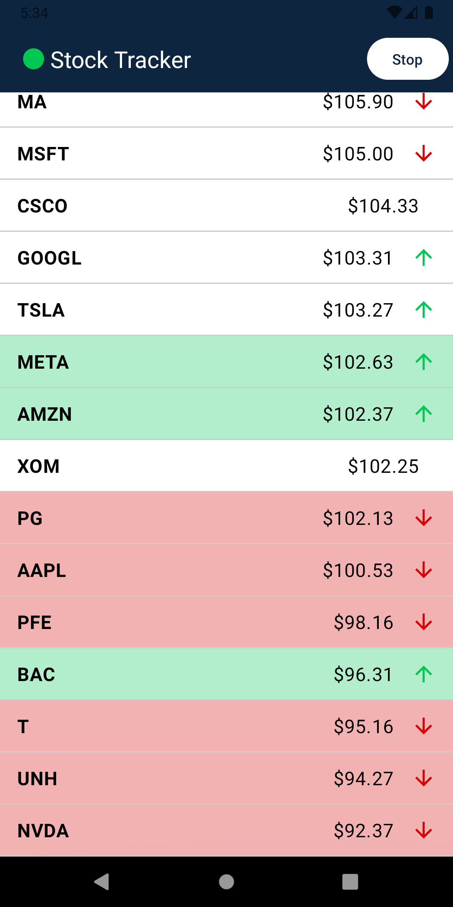
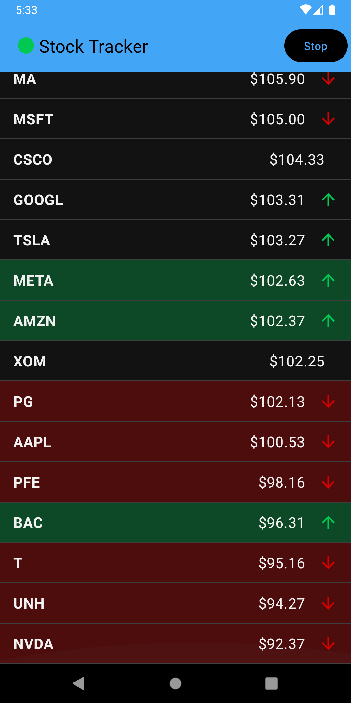

# Stock Tracker App - Android Coding Challenge

This repository contains the source code for a real-time price tracker Android application built as part of a coding challenge. The app displays live price updates for 25 stock symbols using a WebSocket connection.

## 📸 Screenshots

| Light Theme | Dark Theme |
| :---: | :---: |
|  |  |

## ✨ Features

- **Real-Time Price Updates:** Connects to a WebSocket echo server to send and receive mock price data every 2 seconds.
- **Dynamic UI:** Displays a list of 25 stock symbols, sorted by price in real-time.
- **Visual Feedback:** Each row indicates price changes with colored arrows (↑/↓) and a temporary background flash animation.
- **Clean & Modern Tech Stack:** 100% Jetpack Compose, Kotlin, Coroutines, and Flow.
- **Robust Architecture:** Built using MVVM with Clean Architecture principles.
- **Full Theme Support:** Includes custom light and dark themes.
- **Splash Screen:** A modern splash screen for a professional user experience.
- **Well-Tested:** Includes both unit tests for business logic and UI tests for Composables.

## 🏛️ Architecture

This project follows an **MVVM (Model-View-ViewModel)** pattern that is heavily influenced by **Clean Architecture** principles. The goal is to create a clear separation of concerns, making the app scalable, maintainable, and highly testable.

The app is divided into four main layers:

1.  **UI (View) Layer:** (`ui` package) Built entirely with Jetpack Compose. This layer is responsible for displaying the application data. It observes state from the ViewModel and is kept as "dumb" as possible.
2.  **ViewModel Layer:** (`viewmodel` package) Acts as the bridge between the UI and the Domain layer. It holds the UI state in a `StateFlow` and exposes it to the UI. It calls Use Cases to trigger business logic.
3.  **Domain Layer:** (`domain` package) This is the core of the application and is independent of any Android-specific frameworks.
    * **Use Cases:** Encapsulate specific pieces of business logic (e.g., `GetStockUpdatesUseCase`).
    * **Repository Interface:** Defines a contract that the Data layer must implement, decoupling the domain from the data source.
4.  **Data Layer:** (`data` package) Responsible for providing data to the application.
    * **Repository Implementation:** Implements the `PriceRepository` interface. It contains the logic for managing the WebSocket data source and parsing the data.
    * **Data Source:** A `PriceTrackerService` that handles the low-level WebSocket communication.

## 🚀 How to Run the Project

1.  Clone the repository: `git clone https://github.com/abdullah-dalallah/StockTracker.git` 
2.  Open the project in the latest stable version of Android Studio.
3.  Let Gradle sync and build the project.
4.  Run the `app` configuration on an emulator or a physical device.

## 🧪 Instructions for Running Tests

This project includes both unit and instrumented (UI) tests.

### Unit Tests
Unit tests are located in `app/src/test/`. They test the Domain layer (Use Cases) and run on the local JVM.

To run them:
1.  In Android Studio, right-click on the `GetStockUpdatesUseCaseTest.kt` file.
2.  Select "Run 'GetStockUpdatesUseCaseTest'".

### UI Tests
UI tests are located in `app/src/androidTest/`. They test Jetpack Compose components and must be run on an emulator or a physical device.

To run them:
1.  In Android Studio, right-click on the `PriceTrackerScreenTest.kt` file.
2.  Select "Run 'PriceTrackerScreenTest'".

## 📝 Assumptions or Trade-offs

- **Shared Data Model:** For simplicity, the `Stock` data class is shared across all layers (Data, Domain, and UI). In a larger, more complex application, it might be beneficial to have separate models for each layer and map between them.
- **Direct Instantiation:** Dependencies are instantiated directly (e.g., `ViewModel` creates the `UseCase` and `Repository`). For a production app, a dependency injection framework like Hilt would be used to manage dependencies more effectively.

## 🌟 Notes on Bonus Features

All bonus features from the challenge have been implemented:
- [x] Price flashes green on increase and red on decrease.
- [x] Both Compose UI tests and unit tests are included.
- [x] The app fully supports custom light and dark themes.
